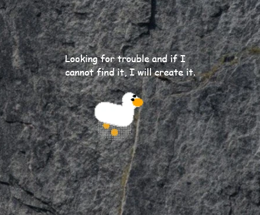

# 🦢 Floating Messages for Desktop Goose
 

  

 

Make your goose talk! This mod adds floating text messages above the DesktopGoose, randomly selected from `.txt` files in the `Messages` folder. 
Whether you want motivational quotes, sarcastic remarks, or pure chaos — your goose now has something to say.

## 📑 Summmary
- [Features](#-features)
- [Installation](#%EF%B8%8F-installation)
- [Example Messages File](#-example-messages-file)
- [Tips](#-tips)
- [Credits](#-credits)
- [License](#-license)
- [Releases](https://github.com/Brvnogr/FloatingMessages/releases)

## 📦 Features

- Reads `.txt` files from the `Messages` folder
- Displays random lines as floating messages above the goose
- Easy to customize — just edit or add your own `.txt` files
- It has a search bar where the goose searches for the word entered and brings up a phrase with that word.
- It also contains a config.ini file to change the font size, color, speech bubble, and more.
- Adds personality, humor, and unpredictability to your goose!

## 🛠️ Installation

1. Download FloatingMessages.zip
2. Extract the `FloatingMessages.zip` folder inside your DesktopGoose `Mods` directory.
3. Add to the `Messages` folder, one or more `.txt` files with your custom messages (one message per line).
4. Inside the `Messages` folder there is the `Ignored` folder, so you can manage many `.txt` without deleting them.
5. Edit the config.ini file as you like
6. Launch DesktopGoose and enjoy the chatter!

## 📁 Example Messages File

- Get some examples in this repository, in the `Assets` folder.
- Create a file like `funny.txt` inside the `Messages` folder: 
  Don't look at me, I'm just a goose. 
  You call this productivity? 
  HONK if you're tired. 
  The goose disapproves of your life choices. 

## 💡 Tips

- Use multiple `.txt` files to keep things fresh and can include emojis or even passive-aggressive reminders.
- Want themed messages? Try naming files like `angry.txt`, `work.txt`, `chaos.txt`.

## 🧠 Credits

Created by Brvnogr 
Inspired by the glorious absurdity of [Desktop Goose](https://samperson.itch.io/desktop-goose)

## 📜 License

This project is open-source under the MIT License. Feel free to modify, share, or remix it — just don't blame the goose for what happens next.
